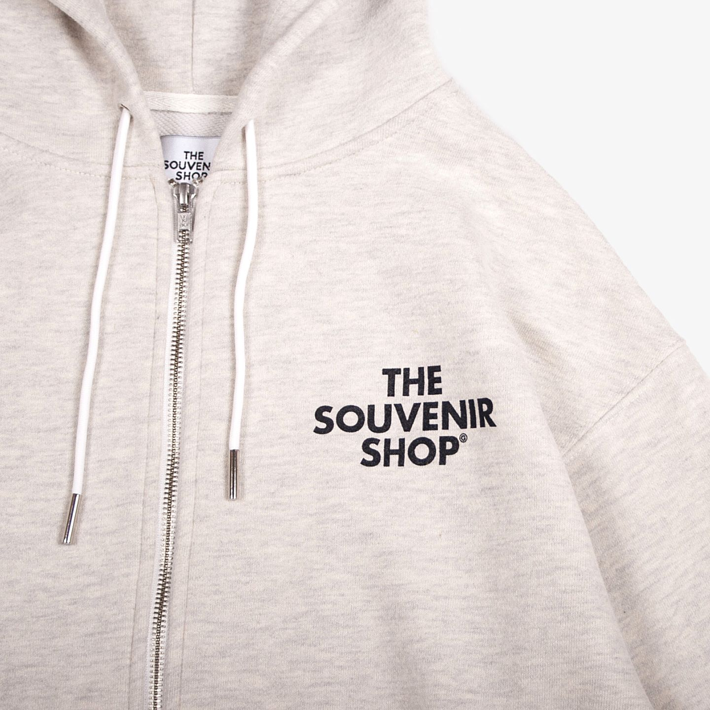
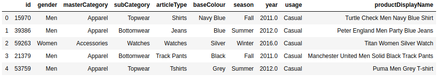
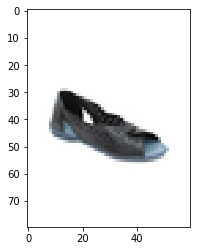
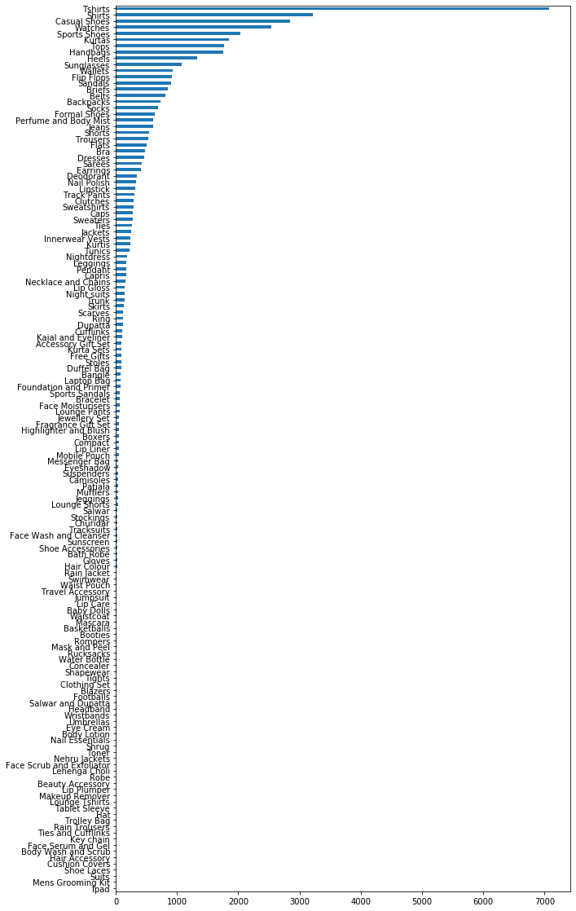
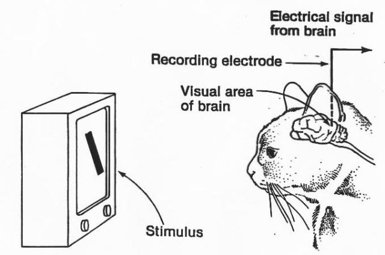
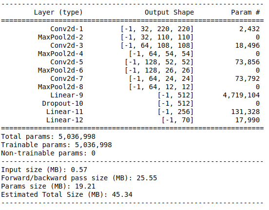
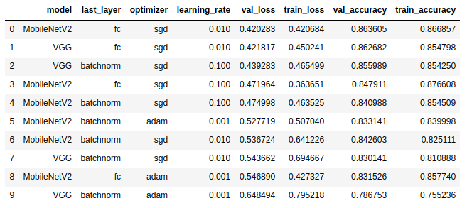

# Machine Learning Engineer Nanodegree

## Fashion Product Image Classifier

Jahyun Koo
November 26, 2019

## I. Definition

### Project Overview

In this project, we performed fashion image classification using deep learning.

The field of computer vision has evolved significantly with the development of deep learning. Advances in deep learning are also driving innovation in the fashion industry.

I'm a developer developing fashion SNS services. Every time I feel the importance of deep learning in my industry. I have a lot of problems that need to be solved using computer vision. 

In the service i'm developing, when a use uploads a fashion image, the operator need to tag it. 



For example, this image is tagged as hood.

We are not using an automated classification algorithm. Therefore, the operator must tag it manually.
This is a very inefficient task. It takes a lot of time and effort.

We have collected approximately 50,000 tagged images to automate this task.
If the algorithm can  automate this task, it will save a lot of time and money.

I tried to find a dataset as close as possible to what I was trying to do.

When i looked up the dataset in Kaggle, there was Fashion Product Dataset. It is very similar to the problem I had to solve. In this project, we used the above dataset to categorize product images. The datasets are provided by [Kaggle website](https://www.kaggle.com/paramaggarwal/fashion-product-images-small). 

The dataset consists of approx 50,000 images and contains image files and csv file with information to make a category label prediction. 

90% accuracy was achieved using CNN-based Transfer Learning as a learning method.

### Problem Statement

Each image belongs to one of the specific categories. So this is a typical multi-class classification problem.
Inputs are image of fashion product, and the goal is to predict category label. Given an image of a fashion product, the algorithm will identify and estimate of the image's category.

### Metrics

We used the F1 Score as the model final assessment. The reason is as follows.

The simplest way is to use accuracy. However, as shown in the dataset exploration above, the distribution of categories is biased, so accuracy-based assessments do not work. If one category has more than the other, performance can be misunderstood for accuracy. Therefore, measuring with accuracy alone is never a good way.

To accurately evaluate model, we need a way to measure model's performance using the Confusion Matrix. Confusion matrix is a table that is often used to describe the performance of a classification model.

|                              | True condition positive | True condition negative |
| ---------------------------- | ----------------------- | ----------------------- |
| Predicted condition positive | TP = True positive      | FP = False positive     |
| Predicted condition negative | FN = False negative     | TN = True negative      |

Several evaluation metrics can be derived from the above Confusion Matrix.

- Accuracy  = (TP + TN) / (TP + FP + TN + FN)
- Precision = TP / (TP + FP)
- Recall = TP / (TP + FN)

We can calculate F1 score from the metrics given above. F1 score is the harmonic mean of precision and recall. The score is multiplied by 2, so if both precision and recall are 1, the score is 1.

- F1 = (2 * Precision * Recall) / (Precision + Recall)

F1 score is more useful than accuracy, especially if dataset has imbalanced category distribution.

## II. Analysis

### Data Exploration

Dataset has information such as `master category`, `sub category`, `article type`, `color`, `season` for each image.



The ID of the image becomes the image file name. The resolution of the image is (80 x 80 x 3). Below is an image of the `Heels` category.
(Kaggle has a high resolution image of the same dataset, but because of the lack of resources to train the model, I use an image dataset with such a low resolution.)



I want to predict `article type` information from several types. This is because the information is most similar to what the actual user wants.

Below is the distribution of categories.



The biggest problem with looking at the distribution is that the number of images in a particular category is very small. Like this, if there is not enough image of a certain category, learning of that category may not work well.

Exclude categories with fewer than 50 images in each category. Except for this, the total number of categories is 70 and the total images are 43,332.

### Algorithms and Techniques

In this project, we use CNN as the structure of deep learning model and Transfer Learning as the learning method. Below is a brief description of our CNN and Transfer Learning.

##### Convolutional Neural Network

In the 1960s, neuroscientists David Hubel and Torsten Wiesel studied neurons responsible for vision. In experiments with cats, they found that similar images consistently stimulate certain areas of the brain, while different images stimulate different areas. The study concluded that different parts of the brain react to each part of the image to recognize the entire image.

There is a part that extracts features when the image enters the head.
https://medium.com/@gopalkalpande/biological-inspiration-of-convolutional-neural-network-cnn-9419668898ac

 Intuitively, people recognize the hierarchical nature of their images the moment they see it. Humans recognize eyes, noses, and mouths by seeing features such as dots and lines in the image, and recognize that the object is a face based on these features.


 The neural network model inspired by this is the Convolutional Neural Network. It is called CNN for short. In other words, CNN is a method to reduce data complexity by combining hierarchical patterns in images only with relatively small and simple filters.

 CNN is a specialized design for image recognition such as images and video. It solves the problem of artificial neural network that was not recognized even if the object is a little skewed by extracting the feature by applying the filter to the whole image. In addition, unlike a general artificial neural network, which has to be weighted by the size of the image, only the filter is trained, so that the learning can be performed with much less computation.

 But deep learning has its limitations. The amount of data, time, and hardware. In general, deep learning requires a lot of data to have high performance. It also calculates and learns millions of times over this data, requiring high specifications, computing resources, and time.

##### Transfer Learning

 The solution to this problem is Transfer Learning. Backbone (Model) is required for transfer learning. Backbone is a deep learning model pretrained to large datasets (such as ImageNext). This backbone acts as a kind of feature extractor.

 Transfer Learning is a technique for training Backbone features to target tasks. In other words, transfer the backbone weight parameters as-is and start learning from the target task data.

 

([Learning and Transferring Mid-Level Image Representations using Convolutional Neural Networks](https://www.cv-foundation.org/openaccess/content_cvpr_2014/papers/Oquab_Learning_and_Transferring_2014_CVPR_paper.pdf))

 When applying a real deep learning model, learning the dataset of the target task using finetuning based on the pretrained backbone is the best way to gain performance. ([Pre-Training Can Improve Model Robustness and Uncertainty](https://arxiv.org/abs/1901.09960))

  Based on the previous research results, this project uses the Transfer Learning method to train the model to classify Fashion Product Image Dataset. Performance is improved by applying several finetuning methods based on the most suitable existing backbone.

### Benchmark

We plan to create a simple cnn model, train it, and use it as a benchmark model. This model is a very simple model with two CNN layers. Since the resolution of the image is not large, I decided that deep learning model with small layers would be a good baseline.



Apply the same process as Data Preprocessing defined in Methodology below, and check the result of applying Simple CNN Model only above model. The optimizer for the Simple CNN Model is adam, and the learning rate is set to 0.001.

The result of training 10 epochs of the above benchmark model is as follows.

The accuracy is 84.6988% and the weighted-F1 score is 0.839673.


## III. Methodology

### Data Preprocessing

Each image is converted using three methods: Resize, Augmentation, and Normalization.

##### Resize

 Images have to be preprocessed from 80x60 to 224x224. We used bicubic interpolation to improve the quality of a low-resolution image when expanding it to 224x224.

##### Augmentation

This is to prevent overfitting the model. One way is to maximize your data. You can crop, rotate, add noise, and change colors in parts of the image.


(출처 : [Image augmentation for machine learning experiments](https://github.com/aleju/imgaug))

##### Normalization

Finally, we need to normalize the data. Applying normalize will make the data more spherical contoured. This makes it easy and fast to find optimization points with the gradient descent algorithm.

### Implementation

The process of training the model through Transfer Learning is as follows.

- backbone selection
- tuning
- evaluation

### Backbone Selection

 Since the performance of the backbone model greatly depends on the target task performance, it is important to choose a good backbone to train. When choosing a pretrained backbone model, you need to determine whether the model is trained from the appropriate dataset and how well the model performs.

#### backbone model's dataset

 It is known to use models that have been trained through large datasets. One such large dataset is ImageNet. ImageNet is known to work well with Transfer Learning.

 Based on the research results, it was known that the more images you use for each class in ImageNet, and the more classes you use to train your model, the better the model's transfer learning performance. ([What makes ImageNet good for transfer learning?](https://arxiv.org/pdf/1608.08614.pdf))


#### backbone model's performance

 Models that perform well on ImageNet also perform well on similar new datasets. Therefore, it is recommended that choose a high-performance deep learning model. Research has shown that Backbone's performance and Target Task's performance is proportional. ([Do Better ImageNet Models Transfer Better?](https://arxiv.org/abs/1805.08974))


#### backbone selection

 We chose the backbone model based on the two criteria above. In the paper [Benchmark Analysis of Representative Deep Neural Network Architectures] (https://arxiv.org/abs/1810.00736), we were able to compare the performance of models trained with ImageNet.


 Exclude large models with complexity or scalability issues. Except for this, we use vgg16 and mobilenet_v2 of the pretrained backbones provided by pytorch. Each model represents a large model (vgg16) and a small model (mobilenet_v2) available for mobile. When applying transfer learning, you also need to consider the size of the backbone. This is because the number and distribution of model parameters affects how much GPU memory is occupied during training or test, that is, the batch size that can be served at one time. The same performance, the smaller the model, the better.

### Training & Evaluation

Proceed with modeling in the following order.

- Data preprocessing
- In order to determine the earning rate, backbone, and optimizer, we train 3 epochs each to determine the hyperparameter that works best.
- Based on the hyperparameter determined above, the final model is determined and the model is trained.
- Proceed to the detailed hyperparameter tuning of the model.
- Evaluate the final model.

### Refinement

Deep learning is a very expensive algorithm. Therefore, it is important to find an appropriate hyperparameter early. In order to find the right backbone and hyperparameter for the dataset, the initial 3 epcoh training is done according to the following conditions.

- backbone = ['mobilenet_v2', 'vgg16']
- learning rate = [0.1, 0.01, 0.001]
- optimizer = ['adam', 'sgd']
- backbone last layer = ['fc', 'batchnorm']

Based on the combination of the above conditions, we train the model 3 epochs each for 24 learning conditions. It is essential to find good conditions because the learning performance of hyperparameters is very different. The backbone last layer is a way to replace the last layer of the backbone model.

fc changes the last layer to a simple Fully Connected layer.

```python
# fc layer
last_layer = torch.nn.Linear(n_inputs, n_outputs)
```

batch norm is a layer with batch norm and dropout as shown below.

```python
keep_prob = 0.5
fc1 = torch.nn.Linear(n_inputs, n_mids, bias=True)
torch.nn.init.xavier_uniform_(fc1.weight)
layer1 = torch.nn.Sequential(fc1,
                             torch.nn.BatchNorm1d(n_mids),
                             torch.nn.ReLU(),
                             torch.nn.Dropout(p=1 - keep_prob))

fc2 = torch.nn.Linear(n_mids, n_outputs, bias=True)
torch.nn.init.xavier_uniform_(fc2.weight)  

last_layer torch.nn.Sequential(layer1, fc2)
```

According to the above conditions, the top-10 models that showed the best performance based on loss of validation set as a result of learning 24 models are as follows.



As a result of checking the above model, the difference between backbone, optimizer and learning_rate is big. Changing the last layer to batchnorm instead of fc hasn't confirmed much difference yet, as the epoch is less than 3.

Based on the above data, we train four models in total.

|             | Backbone    | Last Layer | Optimizer | Learning Rate |
| ----------- | ----------- | ---------- | --------- | ------------- |
| MobileNet-A | MobileNetV2 | fc         | sgd       | 0.010         |
| MobileNet-B | MobileNetV2 | batchnorm  | sgd       | 0.010         |
| VGG-A       | VGG16       | fc         | sgd       | 0.010         |
| VGG-B       | VGG16       | batchnorm  | sgd       | 0.010         |

 We haven't done much learning yet, but the optimal learning rate seems to be 0.010, and the optimizer seems to be learning best using SGD. However, in the case of backbone and last layer, there is a part that can be seen only when the epoch is increased to check for overfitting. Therefore, only the conditions for the backbone and last layer are changed and the final training proceeds.


## IV. Results
### Model Evaluation and Validation
 We conducted model training on the benchmark model and the four models specified above. We trained 10 epochs for each model. After training each model, we applied the model to the test dataset to produce test loss, accuracy, and f1 indicators. The result is shown below.


 All models with Transfer Learning outperformed the benchmark model, SimpleCNNModel.

 First, let's check the model performance difference according to backbone. The VGG16-based model showed the highest performance with a slight margin, but it did not make a big difference with MobileNetV2. MobileNetV2 performed just as well as VGG16 despite its small size.

 There was no significant difference in how the last layer was defined during learning. However, the model using batchnorm was more resistant to overfitting than the model using simple Fully Connected.

MobileNetV2 + FC lossplot


MobileNetV2 + Batch Normalization + Dropout lossplot


 Due to the limitation of learning resources, we could not confirm adaptability to overfitting due to the small number of trainings as small as 10 epochs. However, if you proceed further, the model that last used the layer with batch normalization and dropout may perform best. Models using FC showed overfitting as training progressed.

### Justification

 Models trained with Transfer Learning have up to 5% higher accuracy when compared to the CNN model, the benchmark model. Despite the small size and simple classification problem, we can see that the performance of Transfer Learning is much better. The performance of the final model with Transfer Learning was 90%, which was high enough for the actual product.

 In addition, applying Transfer Learning to multiple backbones has shown that when a dataset is simple and small like this project, using a small model like MobileNet is much more efficient than using a large model like VGG16. Not only was the training time reduced by more than three times, but the performance also showed no significant difference.


## V. Conclusion
### Visualization
 We tested the actual product image with MobileNetV2 + FC based model. This image is resized to (224 x 224) and used for sale on an actual website.


 After testing the model on real images, clear images such as watches and shoes are classified relatively well. However, in the case of ambiguous images, the prediction failed.


 As shown in the image above, the image where two pants overlapped was recognized as `Shirts`. The dataset doesn't seem to be training because it doesn't have the image above.


Clearly and neatly defined images like the clock image above identified the category 'Watches' with 99% accuracy.

### Reflection

 The goal of this project is to categorize fashion product images. We created a deep learning model to categorize about 40,000 images and 70 categories. We trained the model using Transfer Learning. Training using the mobilenet-based backbone resulted in 90% accuracy, which was faster and more accurate than the benchmark CNN-based model.

 The purpose of the project is not only to create deep learning models for fashion images, but also to explore how to apply Transfer Learning correctly. Therefore, we tested several methods of Transfer Learning and put the results in a project report. According to the learning rate, backbone, optimizer, etc., the difference between the learning speed and the final performance of the model is very different.

 Therefore, in the future, learners interested in fashion product classification or transfer learning will be able to reduce trial and error by learning about the correct modeling method through this project report.

 Unfortunately, GPU resources and time limitations prevented us from testing the various methods of transfer learning. Deep Learning is basically a very resource dependent method. Because training a model takes at least an hour. The project was unable to test various cases due to lack of resources. If you can train multiple models at the same time, for example using AWS, you will get more optimal results.

 I also didn't cover much about the Overfitting issue in Transfer Learning. This part is likely to be handled by changes in the data or deep learning structure. This is discussed in the `Improvement` section below.

### Improvement 

 There are two problems with the project. The first is that the deep learning model doesn't make good predictions for unclear product images. The second is overfitting. We noticed that some models experienced overfitting problems during training.

 First, the problem of deep learning models not predicting product images correctly should be solved by acquiring more images. The data provided by the Kaggle dataset is very neat, so it's different from the real world. Therefore, if you want to use the model in a real product, you need to obtain more images and train the model.

 The second problem is overfitting. We tested the final layer with dropout and batch normalization to prevent overfitting when the model fits, but did not achieve the effect of preventing overfitting.

 Therefore, research on how to prevent overfitting when using the Transfer Learning learning method as a follow-up of this project is necessary.

 There are two ways to prevent overfitting during transfer learning.

The first is the data side. Collect more data or increase the augmentation of the data. The second way is to finetun the convnet of the backbone model.

 In this project, we replaced only the last layer of the backbone and freeze the previous layer. It is possible to fine-tune all the layers of the ConvNet, or it ’s possible to keep some of the earlier layers fixed and only fine-tune some higher-level portion of the network. The leading layer in ConvNet is more generic in nature, so you can use this approach.

 Studying how to prevent overfitting could significantly improve the performance of existing models.